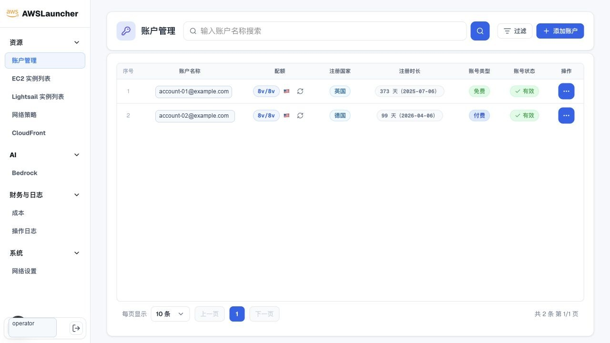
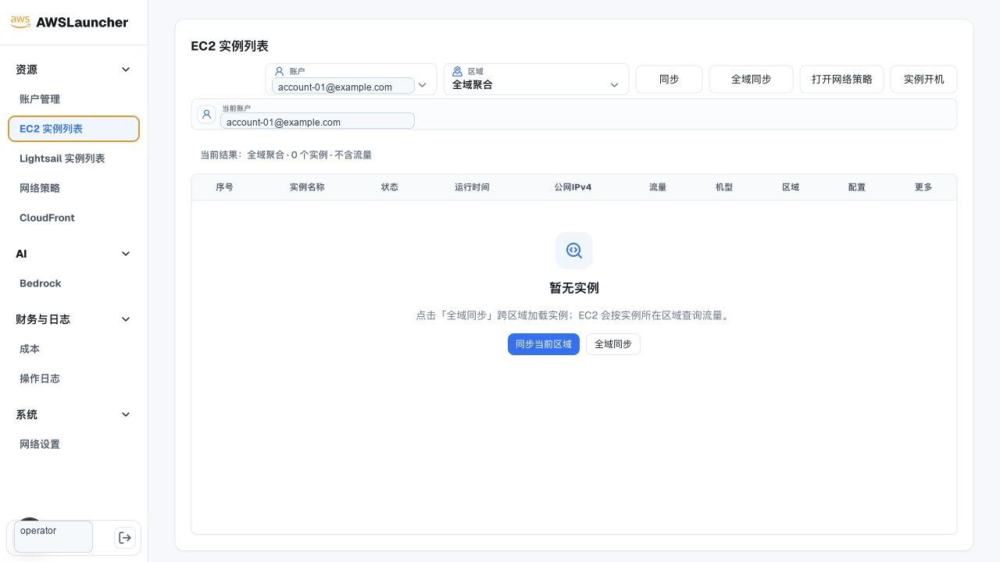
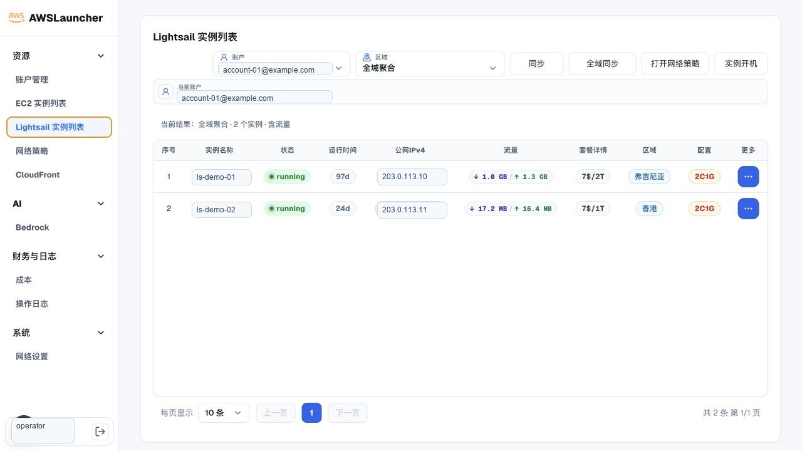
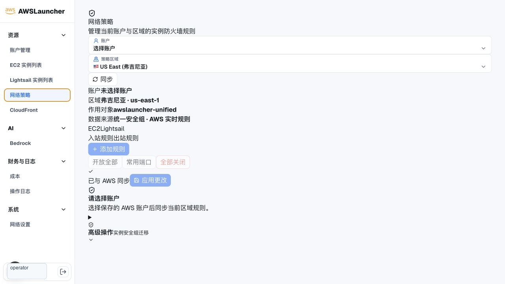
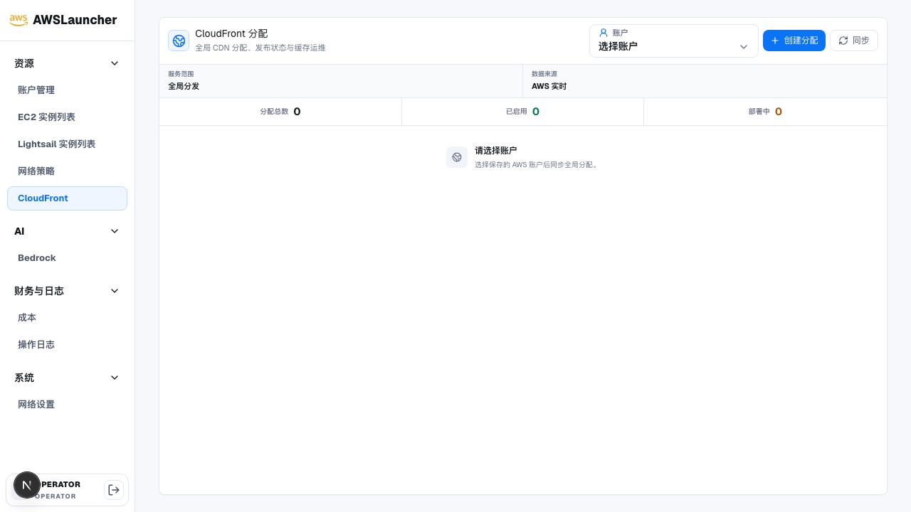
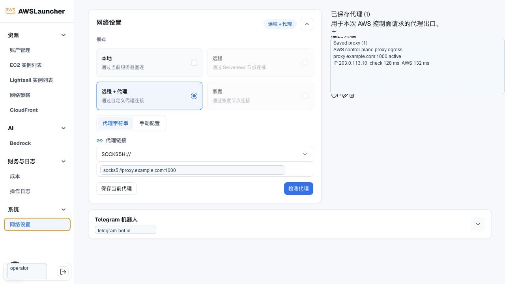

# AWSLauncher Deployment

> 公开构建产物不等于应用源码开源。公开镜像中的编译 JavaScript 仍可能被检查或分析，本项目不承诺构建产物不可逆向。

本仓库只分发 AWSLauncher 的 Docker Compose、Shell 部署工具、Release 校验文件和使用说明，不包含应用源码、测试、Dockerfile 或私有仓库历史。

AWSLauncher 是一个自托管的 AWS 账户与资源操作控制台，适合在自己的服务器上集中管理账号、EC2、Lightsail、CloudFront、网络策略、代理出口和操作日志。

## 功能预览

下面截图来自当前版本的本地控制台，已对邮箱、实例名、IP、代理地址等敏感信息做脱敏处理。

| 账户管理 | EC2 实例列表 |
| --- | --- |
|  |  |

| Lightsail 实例列表 | 网络策略 |
| --- | --- |
|  |  |

| CloudFront 分配 | 网络设置与代理 |
| --- | --- |
|  |  |

## 推荐部署方式

生产或长期使用时，建议始终从 GitHub Release 下载固定版本部署包，不要从 `main` 分支直接复制脚本，也不要只下载单个 `oci-aws.sh` 文件。

推荐流程是：

1. 下载 `oci-aws-vX.Y.Z-deploy.tar.gz`、`release-manifest.json` 和 `SHA256SUMS`。
2. 校验外层 `SHA256SUMS`，确认部署包和发布清单未被篡改。
3. 解压部署包后再次校验内层 `SHA256SUMS`。
4. 执行 `oci-aws.sh install` 安装 Compose 文件、环境变量和服务目录。
5. 用 `oci-aws.sh status` 与浏览器访问确认服务正常。

这种方式会把部署资产和容器镜像版本绑定到同一个稳定 Release，便于审计、升级和回滚。

## 系统要求

- Linux `amd64` 或 `arm64`
- Docker Engine 27 或更高版本
- Docker Compose v2 plugin
- `curl`、`jq`、`tar`、`gzip` 与 `sha256sum`
- 推荐准备一个仅管理员可访问的服务器或内网入口

检查 Docker 与 Compose：

```bash
docker --version
docker compose version
```

如果服务器没有安装 Docker，请先按发行版官方文档安装 Docker Engine 与 Compose plugin。

## 快速安装

下面示例使用 `v0.2.1`，后续升级时把版本号替换成新的稳定 Release。

```bash
version=v0.2.1
base="https://github.com/Nodewebzsz/oci-aws-deploy/releases/download/$version"
bundle="oci-aws-${version}-deploy.tar.gz"

curl -fLO "$base/$bundle"
curl -fLO "$base/release-manifest.json"
curl -fLO "$base/SHA256SUMS"

sha256sum -c SHA256SUMS
tar -xzf "$bundle"
cd "oci-aws-$version"
sha256sum -c SHA256SUMS

sudo bash oci-aws.sh install
sudo /opt/oci-aws/oci-aws.sh status
```

默认访问地址：

```text
http://服务器IP:18168
```

如果你在本机服务器上测试，也可以访问：

```text
http://localhost:18168
```

## 自定义安装目录

默认安装目录是 `/opt/oci-aws`。如需安装到其他目录：

```bash
sudo env OCI_AWS_INSTALL_DIR=/srv/oci-aws bash oci-aws.sh install
sudo /srv/oci-aws/oci-aws.sh status
```

安装目录中会保存：

| 路径 | 说明 |
| --- | --- |
| `compose.yml` | Docker Compose 配置 |
| `.env` | 运行时环境变量，权限固定为 `0600` |
| `data/oci-aws.sqlite` | 本地 SQLite 数据库 |
| `backups/` | 自动或手动备份 |
| `.previous-version` | 回滚使用的上一版本记录 |
| `oci-aws.sh` | 管理脚本 |

## 环境变量

安装脚本会从 `.env.example` 生成 `.env`。常用配置如下：

| 配置 | 默认值 | 说明 |
| --- | --- | --- |
| `OCI_AWS_INSTALL_DIR` | `/opt/oci-aws` | Shell 工具的安装目录覆盖值，不写入 `.env` |
| `OCI_AWS_VERSION` | Release 注入 | 稳定 Release 会写入对应 `vX.Y.Z` 或不可变 `sha-*` 标签 |
| `PORT` | `18168` | 宿主机和容器监听端口 |
| `AUTH_COOKIE_SECURE` | `false` | 通过 HTTPS 访问时改为 `true` |
| `OCI_AWS_RUNTIME_UID` | `1001` | root 安装时的非 root 容器 UID |
| `OCI_AWS_RUNTIME_GID` | `1001` | root 安装时的非 root 容器 GID |
| `OCI_AWS_SECRET_KEY` | 首次安装生成 | 至少 32 字节的加密种子，更新不会覆盖 |

不要公开 `.env`，也不要在数据库仍需使用时重新生成 `OCI_AWS_SECRET_KEY`。如果丢失该密钥，历史加密数据可能无法正常解密。

## 常用命令

```bash
sudo /opt/oci-aws/oci-aws.sh status
sudo /opt/oci-aws/oci-aws.sh version
sudo /opt/oci-aws/oci-aws.sh logs
sudo /opt/oci-aws/oci-aws.sh start
sudo /opt/oci-aws/oci-aws.sh stop
sudo /opt/oci-aws/oci-aws.sh backup
sudo /opt/oci-aws/oci-aws.sh update v0.2.1
sudo /opt/oci-aws/oci-aws.sh rollback
sudo /opt/oci-aws/oci-aws.sh uninstall
```

`status` 会显示容器状态；`logs` 用于排查启动和运行问题；`backup` 会复制当前 SQLite 数据库到 `backups/`。

## 升级

升级到指定稳定版本：

```bash
sudo /opt/oci-aws/oci-aws.sh update v0.2.1
```

不带版本号时，脚本会查询公开 Release 并选择最新稳定统一版本：

```bash
sudo /opt/oci-aws/oci-aws.sh update
```

升级过程会：

1. 下载目标版本部署包、发布清单和校验文件。
2. 校验外层与内层 `SHA256SUMS`。
3. 拉取目标镜像。
4. 备份当前 SQLite 数据库。
5. 替换部署资产并重启服务。
6. 健康检查失败时恢复上一套部署资产和镜像 digest。

`update latest` 是显式选择移动镜像别名的方式，只更新镜像，不替换已安装的部署资产。审计、生产升级和回滚应优先使用稳定 Release 或不可变 digest。

## 回滚

如果升级后需要恢复上一版本：

```bash
sudo /opt/oci-aws/oci-aws.sh rollback
```

`rollback` 使用 `.previous-version` 中记录的 `sha-*` 标签和完整 digest，不依赖移动的 `latest` 标签。回滚不会自动覆盖当前数据库；如需恢复数据库，请从 `backups/` 中选择对应备份并手动替换。

## 手动 Compose 部署

如果你不想安装管理脚本，也可以直接使用公开仓库中的单容器 Compose 文件：

```bash
curl -fLO https://raw.githubusercontent.com/Nodewebzsz/oci-aws-deploy/main/compose.yml

mkdir -p data
sudo chown -R 1001:1001 data
sudo chmod 700 data
OCI_AWS_SECRET_KEY=$(openssl rand -hex 32)
cat > .env <<EOF
OCI_AWS_VERSION=v0.2.2
PORT=18168
AUTH_COOKIE_SECURE=false
OCI_AWS_RUNTIME_UID=1001
OCI_AWS_RUNTIME_GID=1001
OCI_AWS_SECRET_KEY=$OCI_AWS_SECRET_KEY
EOF
chmod 600 .env

docker compose up -d
docker compose ps
docker compose logs -f
```

`latest` 是最新稳定版的移动标签。比如当前 `v0.2.2` 稳定发布成功后，`latest` 会指向这次稳定镜像；但以后发布
`v0.2.3` 时，`latest` 又会移动。生产环境建议把 `OCI_AWS_VERSION` 固定为具体版本号或不可变 `sha-*`，
这样重启和迁移时不会意外升级。只有明确想持续跟随最新稳定版时，才把它写成 `latest`。

容器默认使用非 root 的 `1001:1001` 运行，宿主机的 `./data` 必须允许这个 UID/GID 写入；否则注册或登录时
SQLite 会返回 `unable to open database file`。如果你修改 `OCI_AWS_RUNTIME_UID/GID`，请同步调整 `data`
目录 owner。

手动部署需要你自己负责 `.env` 权限、数据库备份、升级、回滚和健康检查。长期使用建议改用 `oci-aws.sh install`。

## 反向代理与 HTTPS

如果通过域名访问，建议在外层使用 Nginx、Caddy、Traefik 或云厂商负载均衡做 HTTPS 终止，然后把请求转发到本机 `18168` 端口。

启用 HTTPS 后，把 `.env` 中的 Cookie 配置改为：

```env
AUTH_COOKIE_SECURE=true
```

示例 Nginx 片段：

```nginx
server {
    listen 443 ssl http2;
    server_name awslauncher.example.com;

    location / {
        proxy_pass http://127.0.0.1:18168;
        proxy_http_version 1.1;
        proxy_set_header Host $host;
        proxy_set_header X-Forwarded-For $proxy_add_x_forwarded_for;
        proxy_set_header X-Forwarded-Proto https;
        proxy_set_header Upgrade $http_upgrade;
        proxy_set_header Connection "upgrade";
    }
}
```

## 数据与备份

核心数据默认保存在：

```text
/opt/oci-aws/data/oci-aws.sqlite
```

备份命令：

```bash
sudo /opt/oci-aws/oci-aws.sh backup
```

建议同时备份：

- `/opt/oci-aws/data/oci-aws.sqlite`
- `/opt/oci-aws/.env`
- `/opt/oci-aws/backups/`

`.env` 中的 `OCI_AWS_SECRET_KEY` 与数据库是一组，恢复时要一起保留。

## 镜像与发布校验

公开镜像：

```text
ghcr.io/nodewebzsz/oci-aws
```

查看某个版本的多架构 manifest：

```bash
docker buildx imagetools inspect ghcr.io/nodewebzsz/oci-aws:v0.2.1
```

查看 Release 所绑定的镜像 digest、源码 revision 与签名身份：

```bash
jq . release-manifest.json
```

稳定发布提供 `vX.Y.Z`、`X.Y.Z`、`X.Y`、`sha-*` 和 `latest` 标签。审计与回滚应优先使用完整 digest 或 `sha-*`。

## 安全建议

- 不要把服务直接暴露给不可信公网，至少使用 HTTPS、强密码和访问控制。
- 不要公开 `.env`、SQLite 数据库、备份文件或代理配置。
- 不要在多人共享服务器上给非管理员开放安装目录写权限。
- 代理配置可能包含用户名、密码和出口 IP，应按凭据处理。
- AWS 账号凭据、操作日志和资源缓存都在本地数据库中，迁移服务器时要按敏感数据处理。
- 如果怀疑 `.env` 或数据库泄露，应立即轮换 AWS 凭据和代理凭据。

## 常见问题

### 校验失败怎么办？

删除下载目录，重新从 GitHub Release 下载 `oci-aws-vX.Y.Z-deploy.tar.gz`、`release-manifest.json` 和 `SHA256SUMS`。不要执行校验失败的文件。

### 端口被占用怎么办？

修改 `.env` 中的 `PORT`，然后重启：

```bash
sudo /opt/oci-aws/oci-aws.sh stop
sudo /opt/oci-aws/oci-aws.sh start
```

### 如何查看启动失败原因？

```bash
sudo /opt/oci-aws/oci-aws.sh logs
docker compose -f /opt/oci-aws/compose.yml ps
```

### 如何确认当前版本？

```bash
sudo /opt/oci-aws/oci-aws.sh version
```

### 是否可以从 main 分支安装？

不建议。`main` 分支内容可能和已签名镜像、Release 清单不完全对应。请使用固定 `vX.Y.Z` Release。

## 许可

本仓库内的部署文件使用 MIT License。MIT 不适用于 AWSLauncher 应用镜像或私有应用源码；镜像公开分发不构成应用源码开源授权。
